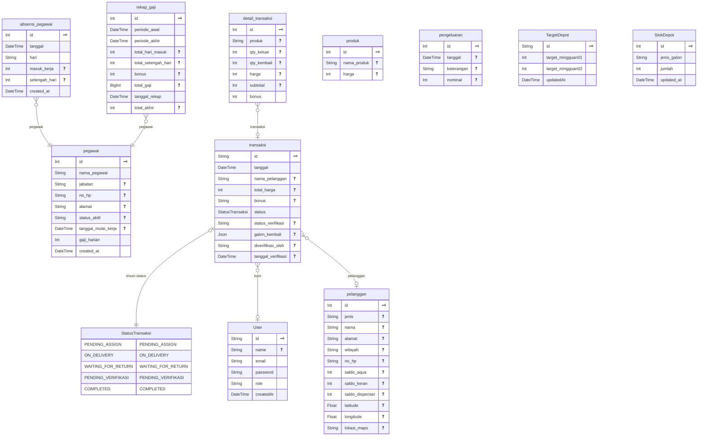

```mermaid
erDiagram

        StatusTransaksi {
            PENDING_ASSIGN PENDING_ASSIGN
ON_DELIVERY ON_DELIVERY
WAITING_FOR_RETURN WAITING_FOR_RETURN
PENDING_VERIFIKASI PENDING_VERIFIKASI
COMPLETED COMPLETED
        }
    
  "pegawai" {
    Int id "🗝️"
    String nama_pegawai 
    String jabatan "❓"
    String no_hp "❓"
    String alamat "❓"
    String status_aktif "❓"
    DateTime tanggal_mulai_kerja "❓"
    Int gaji_harian 
    DateTime created_at 
    }
  

  "absensi_pegawai" {
    Int id "🗝️"
    DateTime tanggal 
    String hari 
    Int masuk_kerja "❓"
    Int setengah_hari "❓"
    DateTime created_at 
    }
  

  "rekap_gaji" {
    Int id "🗝️"
    DateTime periode_awal 
    DateTime periode_akhir 
    Int total_hari_masuk "❓"
    Int total_setengah_hari "❓"
    Int bonus "❓"
    BigInt total_gaji "❓"
    DateTime tanggal_rekap 
    Int total_akhir "❓"
    }
  

  "transaksi" {
    String id "🗝️"
    DateTime tanggal 
    String nama_pelanggan "❓"
    Int total_harga "❓"
    String bonus "❓"
    StatusTransaksi status 
    String status_verifikasi "❓"
    Json galon_kembali "❓"
    String diverifikasi_oleh "❓"
    DateTime tanggal_verifikasi "❓"
    }
  

  "detail_transaksi" {
    Int id "🗝️"
    String produk "❓"
    Int qty_keluar "❓"
    Int qty_kembali "❓"
    Int harga "❓"
    Int subtotal "❓"
    Int bonus 
    }
  

  "pelanggan" {
    Int id "🗝️"
    String jenis "❓"
    String nama "❓"
    String alamat "❓"
    String wilayah "❓"
    String no_hp "❓"
    Int saldo_aqua "❓"
    Int saldo_keran "❓"
    Int saldo_dispenser "❓"
    Float latitude "❓"
    Float longitude "❓"
    String lokasi_maps "❓"
    }
  

  "produk" {
    Int id "🗝️"
    String nama_produk "❓"
    Int harga "❓"
    }
  

  "pengeluaran" {
    Int id "🗝️"
    DateTime tanggal "❓"
    String keterangan "❓"
    Int nominal "❓"
    }
  

  "User" {
    String id "🗝️"
    String name "❓"
    String email 
    String password 
    String role 
    DateTime createdAt 
    }
  

  "TargetDepot" {
    String id "🗝️"
    Int target_mingguan01 
    Int target_mingguan02 
    DateTime updatedAt 
    }
  

  "StokDepot" {
    Int id "🗝️"
    String jenis_galon 
    Int jumlah 
    DateTime updated_at 
    }
  
    "absensi_pegawai" }o--|| "pegawai" : "pegawai"
    "rekap_gaji" }o--|| "pegawai" : "pegawai"
    "transaksi" |o--|| "StatusTransaksi" : "enum:status"
    "transaksi" }o--|o "User" : "kurir"
    "transaksi" }o--|o "pelanggan" : "pelanggan"
    "detail_transaksi" }o--|o "transaksi" : "transaksi"
```
